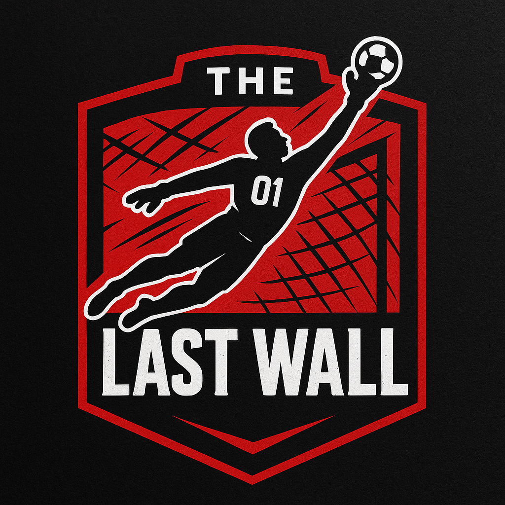

  

<h1 align="center">
  
</h1>

<em>“Goleiros não nascem prontos. São forjados na pressão.”</em>

---

## 🧱 Sobre o Projeto

**The Last Wall** é a primeira plataforma digital feita especialmente para **goleiros em formação**.  
Com foco em **educação tática**, **avaliação contínua** e **evolução personalizada**, ela transforma treino e aprendizado em uma experiência digital completa.

Criada com paixão, tecnologia e visão de futuro, essa é **a nova era do treinamento para goleiros**.

---

## ⚙️ Funcionalidades Atuais

- ✅ Quizzes técnicos e táticos para desafiar o conhecimento  
- ✅ Dashboards personalizados com gráficos e evolução  
- ✅ Layout moderno, responsivo e pensado para o atleta  
- ✅ Experiência fluida e acessível em qualquer dispositivo

---

## 🚀 O Que Está Por Vir

A muralha está em construção — veja o que vem por aí:

- 🧬 **Sistema de níveis e conquistas** com progressão gamificada  
- 📈 **Minigames** focados em reflexo, decisão e tempo de reação  
- 📹 **Upload de treinos com feedback automatizado**  
- 📊 **Comparativo de performance com outros goleiros**  
- 🌐 **Ranking e comunidade de goleiros para troca de experiências**  
- 🔔 **Calendário de treinos, desafios semanais e metas**  
- 🧠 **Assistente digital com sugestões de evolução personalizada**

---

## 💻 Tecnologias Utilizadas

  
  
  
  
  

---

## 📊 Status do Projeto

🚧 **Fase inicial ativa**  
🔄 Em constante evolução  
💬 Abertura total para sugestões e contribuições

---

## 🤝 Contribuindo

Você é goleiro? Dev? Designer? Fã de tecnologia?  
**Esse projeto é feito pra você também!**

- Abra um **issue** com ideias e sugestões  
- Faça um **pull request** com melhorias  
- Espalhe o projeto entre outros atletas e devs

---

## ⭐ Apoie essa Muralha

Se você acredita na importância do goleiro e no poder da tecnologia,  
**deixe uma estrela ⭐** e acompanhe o crescimento da plataforma!

  

